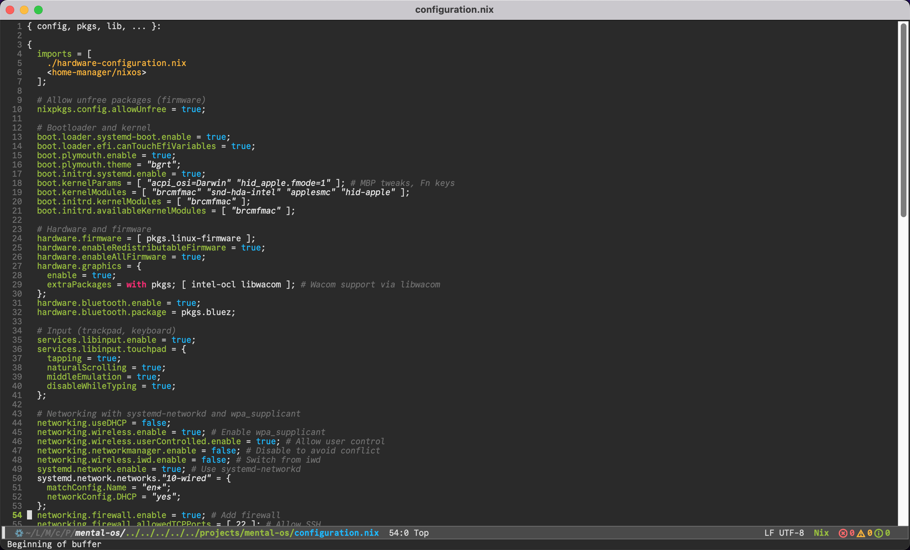
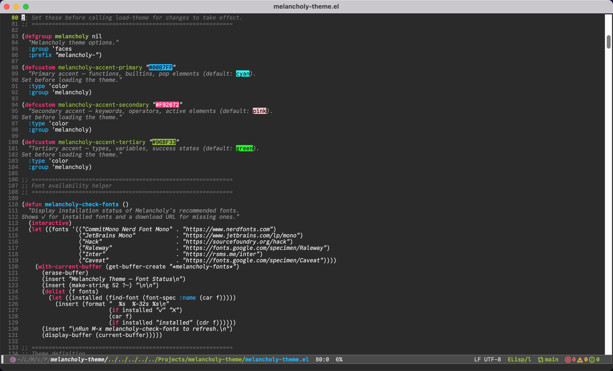
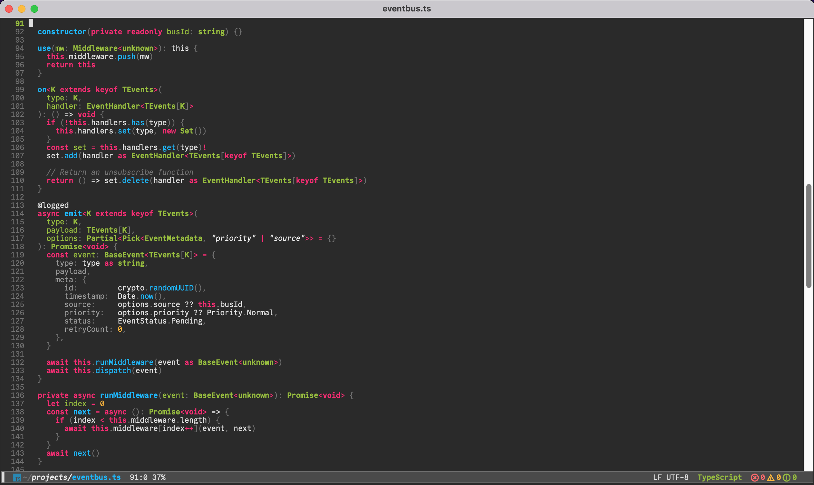
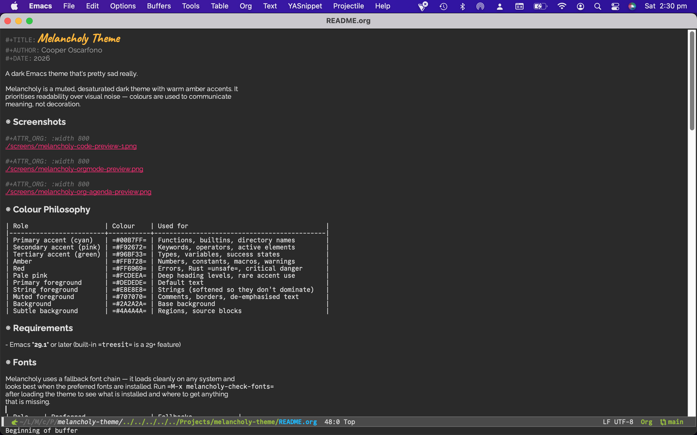
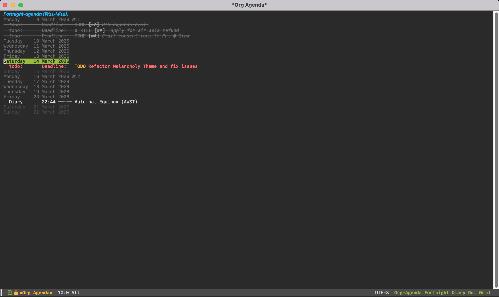

#+TITLE: Melancholy Theme
#+AUTHOR: Cooper Oscarfono
#+DATE: 2026

A dark Emacs theme that's pretty sad really.

Melancholy is a muted, desaturated dark theme with warm amber accents. It
prioritises readability over visual noise — colours are used to communicate
meaning, not decoration.

* Screenshots

#+ATTR_ORG: :width 800

#+ATTR_ORG: :width 800

#+ATTR_ORG: :width 800

#+ATTR_ORG: :width 800

#+ATTR_ORG: :width 800

* Colour Philosophy

| Role                    | Colour    | Used for                                  |
|-------------------------+-----------+-------------------------------------------|
| Primary accent (cyan)   | =#00B7FF= | Functions, builtins, directory names      |
| Secondary accent (pink) | =#F92672= | Keywords, operators, active elements      |
| Tertiary accent (green) | =#96BF33= | Types, variables, success states          |
| Amber                   | =#FFB728= | Numbers, constants, macros, warnings      |
| Red                     | =#FF6969= | Errors, Rust =unsafe=, critical danger    |
| Pale pink               | =#FCDEEA= | Deep heading levels, rare accent use      |
| Primary foreground      | =#DEDEDE= | Default text                              |
| String foreground       | =#E8E8E8= | Strings (softened so they don't dominate) |
| Muted foreground        | =#707070= | Comments, borders, de-emphasised text     |
| Background              | =#2A2A2A= | Base background                           |
| Subtle background       | =#4A4A4A= | Regions, source blocks                    |

* Requirements

- Emacs *29.1* or later (built-in =treesit= is a 29+ feature)

* Fonts

Melancholy uses a fallback font chain — it loads cleanly on any system and
looks best when the preferred fonts are installed. Run =M-x melancholy-check-fonts=
after loading the theme to see what is installed and where to get anything
that is missing.

| Role    | Preferred                 | Fallbacks            |
|---------+---------------------------+----------------------|
| Mono    | CommitMono Nerd Font Mono | JetBrains Mono, Hack |
| Sans    | Raleway                   | Inter, sans-serif    |
| Cursive | Caveat                    | Segoe Print, serif   |

** Installing fonts

*CommitMono Nerd Font Mono*

#+begin_src shell
# Download from https://www.nerdfonts.com/font-downloads
# Search for "CommitMono" — install the Nerd Font patched version,
# not the plain CommitMono, so that icon glyphs render correctly.
#+end_src

*Raleway* and *Caveat* are available from Google Fonts:

#+begin_src shell
# Arch / Manjaro
paru -S ttf-raleway ttf-caveat

# Nix
nix-env -iA nixpkgs.google-fonts   # includes both

# macOS (Homebrew)
brew install --cask font-raleway font-caveat

# Ubuntu / Debian — install manually from fonts.google.com
#+end_src

* Installation

** straight.el (recommended)

#+begin_src emacs-lisp
(use-package melancholy-theme
  :straight (:type git :host github :repo "oscarfono/melancholy-theme"
             :files ("*.el"))
  :config
  (add-to-list 'custom-theme-load-path
               (file-name-directory
                (locate-file "melancholy-theme.el" load-path)))
  (load-theme 'melancholy t))
#+end_src

** MELPA

#+begin_src emacs-lisp
(use-package melancholy-theme
  :ensure t
  :config
  (load-theme 'melancholy t))
#+end_src

** Manual

Clone or download =melancholy-theme.el= to =~/.emacs.d/themes/=, then:

#+begin_src emacs-lisp
(add-to-list 'custom-theme-load-path "~/.emacs.d/themes/")
(load-theme 'melancholy t)
#+end_src

* Customisation

The three accent colours can be overridden before loading the theme:

#+begin_src emacs-lisp
(setq melancholy-accent-primary   "#00B7FF"   ; cyan  — functions, builtins
      melancholy-accent-secondary "#F92672"   ; pink  — keywords, operators
      melancholy-accent-tertiary  "#96BF33")  ; green — types, variables
(load-theme 'melancholy t)
#+end_src

* Package Coverage

Melancholy provides faces for the following packages. If you use something
not on this list, open an issue.

| Category     | Packages                                                        |
|--------------+-----------------------------------------------------------------|
| Completion   | vertico, corfu, marginalia, orderless, consult, helm            |
| Editing      | smartparens, rainbow-delimiters, symbol-overlay                 |
| Navigation   | treemacs, speedbar, dired                                       |
| VCS          | magit, diff-hl                                                  |
| LSP          | lsp-mode, lsp-ui, eglot (including inlay hints)                 |
| Search       | consult, deadgrep, rg.el, wgrep, grep                           |
| Syntax check | flycheck, flymake                                               |
| Org          | org-mode, org-agenda (full coverage)                            |
| Email/RSS    | notmuch, gnus, elfeed, erc                                      |
| UI           | which-key, nerd-icons, all-the-icons, indent-guide              |
| Frames/tabs  | tab-bar, tab-line, perspective, window-divider                  |
| Terminal     | term, vterm (full 16-colour ANSI set including bright variants) |
| Languages    | JS/TS, Python, Go, Rust, Zig, C/C++, Bash, Nix, Terraform       |
| Tree-sitter  | Built-in =treesit= faces (Emacs 29+) + =*-ts-mode= faces.       |
|              | The third-party =tree-sitter= package is *not* supported.       |

* Changelog

** v5.0 (2026-03-13)

- Font fallback chains — theme loads cleanly without preferred fonts installed
- =melancholy-check-fonts= interactive command to report font status
- =defcustom= accent colour overrides for primary, secondary, tertiary accents
- Migrated tree-sitter support to built-in =treesit= (Emacs 29+);
  dropped support for third-party =tree-sitter= package
- Bumped =Package-Requires= minimum to Emacs 29.1
- Added nerd-icons faces (successor to all-the-icons)
- Added indent-guide, highlight-indent-guides
- Added symbol-overlay
- Added wgrep, deadgrep, rg.el, full grep face set
- Full 16-colour ANSI term face set including bright variants
- Added notmuch and elfeed faces
- Added treemacs and perspective faces
- Full magit face coverage: branches, log graph, bisect, process status
- Full org-mode coverage: checkboxes, citations, drawers, ellipsis
- Full corfu, vertico, marginalia, consult, orderless face sets
- Eglot inlay hint faces (type, parameter, general)
- Fixed =shadow= face (was setting =:background=, corrected to =:foreground=)
- Progressive heading heights in org-mode for visual hierarchy
- =org-level= foregrounds now all explicit (no silent inheritance gaps)
- Added macOS font installation instructions

** v4.1

- Tree-sitter and language-specific faces: JS/TS, Bash, Python, Go, Zig, Rust, C/C++
- lsp-mode and eglot faces

** v4.0

- Contrast fixes (WCAG AA compliance for key faces)
- =mode-line= and =mode-line-inactive= (were completely missing)
- =tab-bar=, =window-divider=, =fill-column-indicator=
- Completion framework faces: vertico, corfu, marginalia, orderless, consult
- which-key, rainbow-delimiters, diff-hl
- TTY support via =:type= display class splits

* Contributing

Issues and pull requests welcome at [[https://github.com/oscarfono/melancholy-theme][github.com/oscarfono/melancholy-theme]].

If you are adding faces for a new package, please follow the existing colour logic:

- Cyan (primary) :: functions, builtins, things you *call*
- Pink (secondary) :: keywords, operators, language-level signals
- Green (tertiary) :: types, variables, structural shapes
- Amber :: numbers, constants, macros, warm literals
- Red :: errors, danger, things that need attention
- Grey tones :: comments, punctuation, anything that should recede

* Licence

This program is free software: you can redistribute it and/or modify
it under the terms of the GNU General Public License as published by
the Free Software Foundation, version 3 or later.
